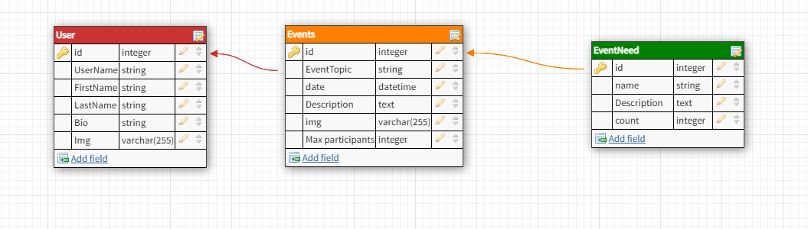
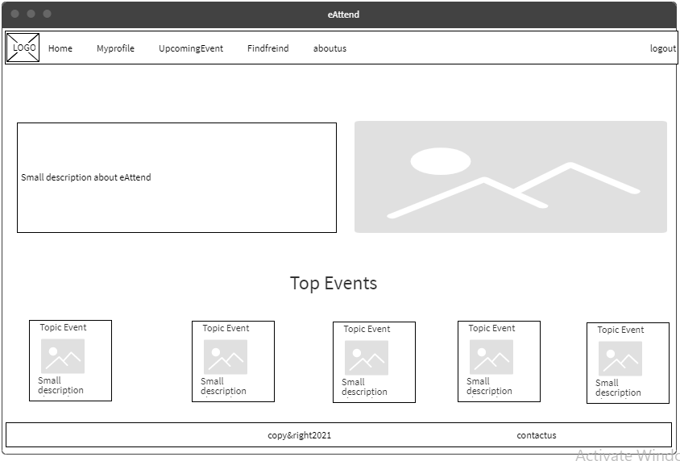
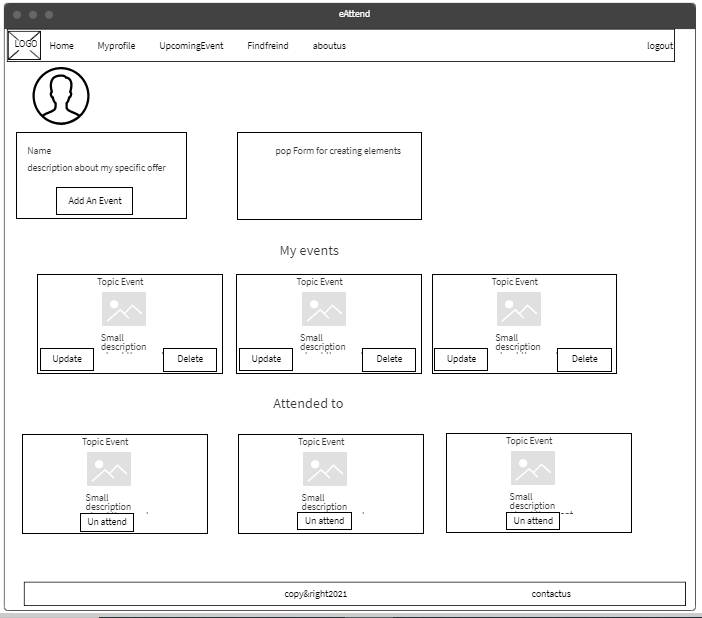
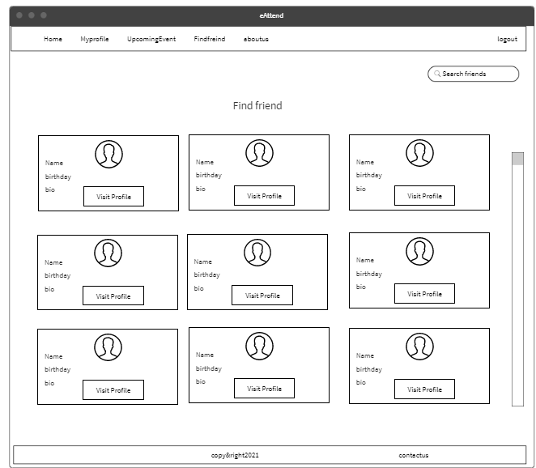
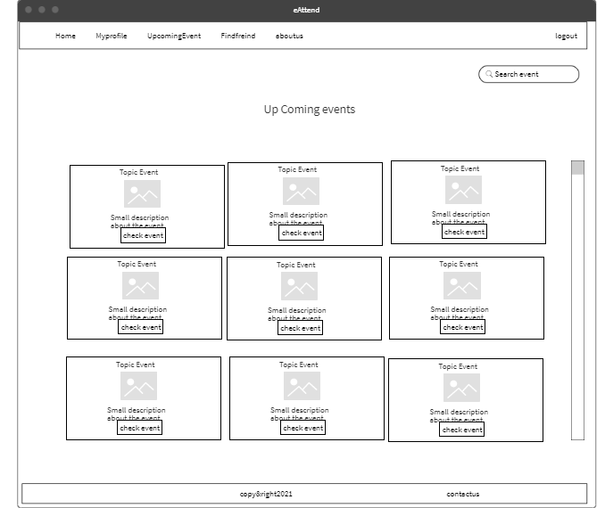
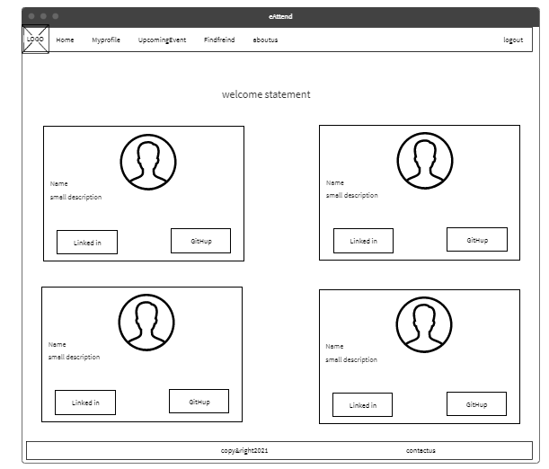

# Events-Platform

## Members Names:
1. Humam Mkhzoumi
2. Hala Khamayseh
3. Nooraldeen Khalf
4. Baraa Alosaily

## Project description:
What is e-Attend :A web application project that allows you to create an event with specific roles and that event will be self organized by other users attendance to it , each one want to attend the event will fill a simple form about what he can offer to help with that event, once the event seats are filled, the event will be closed automatically .

## Problem Domain:

1. Make it easier to organize events.
2. Make it easier for people to search and attend puplic events.

## User Stories:

### Feature1:
 As a user, I want a personnel accounts ,I can login into  with username and password.
### Feature2:
 As a user, I want to be able to announce an event,so people can attend to it.
### Feature3:
 As a user, I want to search  for specific event and attend to it.
### Feature4:
 As a user, I want to be able to add other users as freind.

## Trello link:
[trello](https://trello.com/b/ASRyw3fR/401-mid-project)

## Relationship Diagram

## Wireframe

